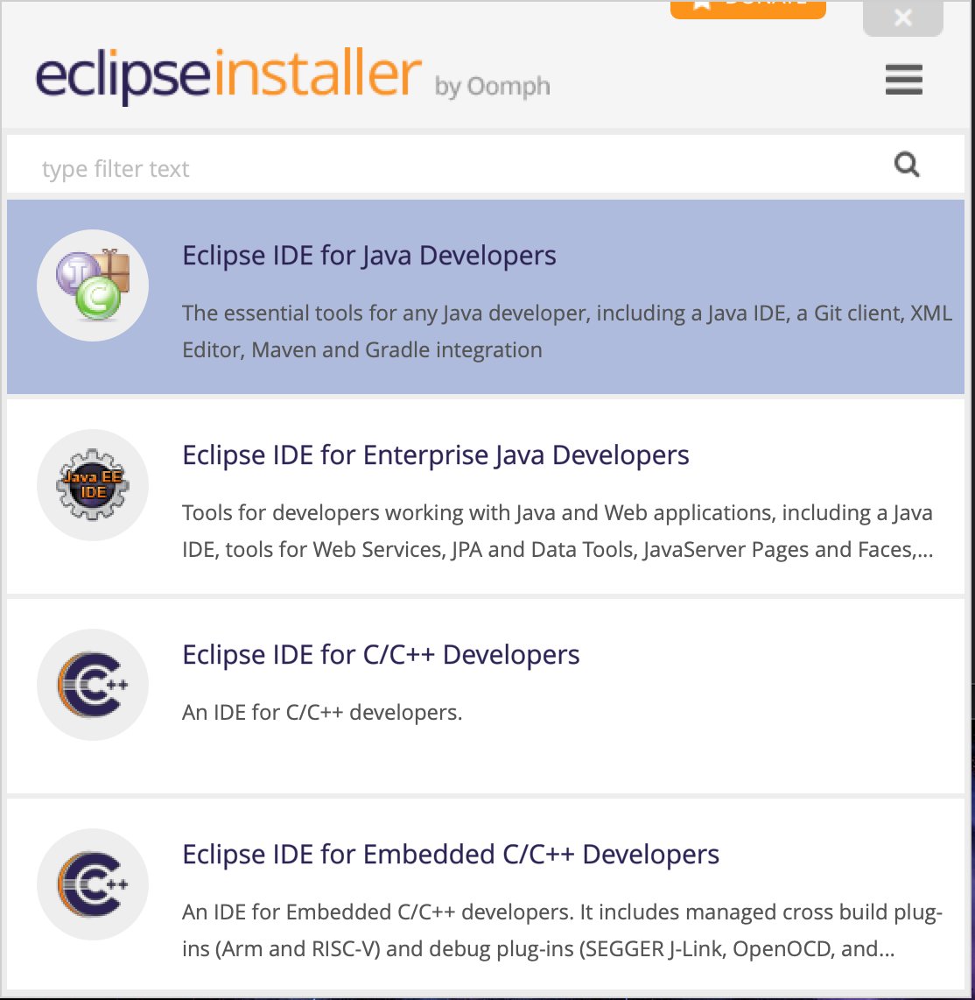

# Opzetten MacBook voor Development

## Git

Zodra je een git command uitvoert, zal de MacBook automatisch git gaan installeren.

`git clone <git-repo-url>`

## SDKman

Java en Maven zijn allebei geinstalleerd via SDKman.
Voor installatie van Java tools, wordt SDKman  gebruikt.

Gebruik [SDKman install](https://sdkman.io/install) voor installatie.

Controleer of SDKman draait:

`$ sdk`

### Java

Installatie Java JDK met behulp van SDKman.

Welke java edities zijn beschikbaar:

`$ sdk list java`

Kies een *editie* uit de lijst (achteraan in tabel).

`$ sdk list java 11.0.9.hs-adpt`

Controleer of Java beschikbaar is:

    $ java -version

### Maven

Installatie Maven JDK met behulp van SDKman.

Welke tools zijn beschikbaar:

    $ sdk list

Zoeken in de lijst kan met `/<zoek woord>`
Verlaten van de lijst `q`

> Als goed is zul je maven kunnen vinden. Recht bij de tool, staat al een tip, wat SDKman command je moet gebruiken om de tool te installeren.

    $ sdk install maven

## Eclipse

